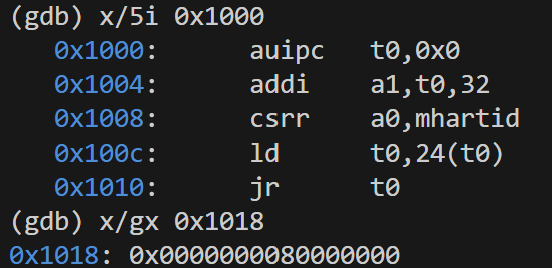
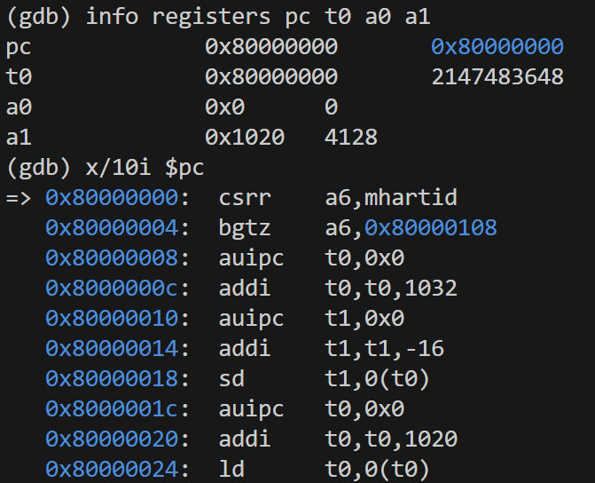
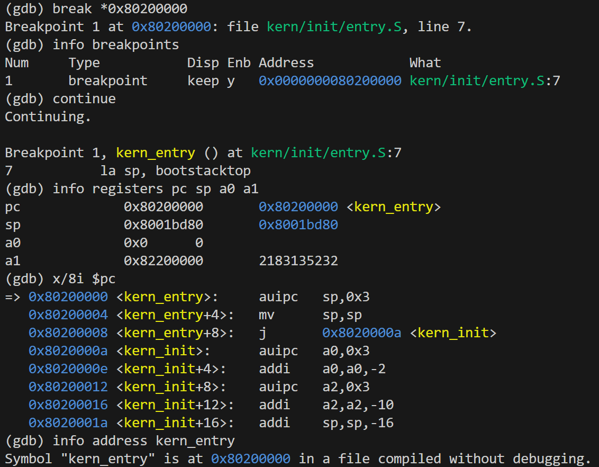
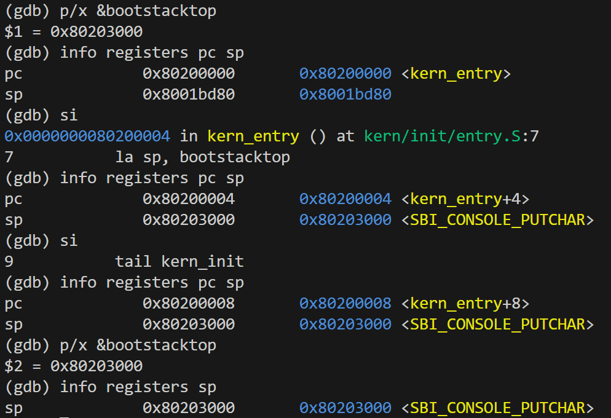
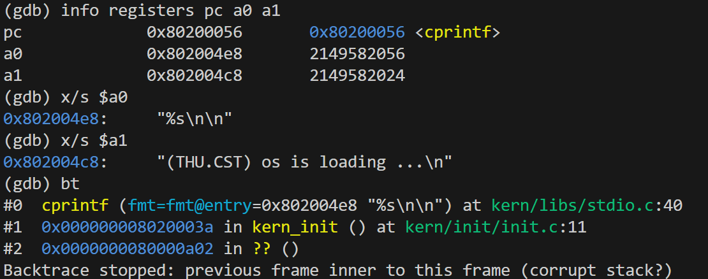
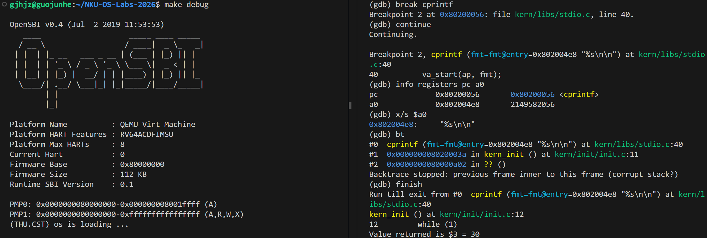

# Lab 1：使用 GDB 验证 RISC-V 内核启动流程

实验者：国峻赫  
实验日期：2026 年 10 月 6 日  
对应任务：练习 2；补充验证练习 1 的入口操作


## 1. 实验目的与范围

本次实验根据 Lab 0–1 实验手册，使用 QEMU 和 GDB 跟踪模拟 RISC-V 计算机从复位引导代码开始执行、进入 OpenSBI、再进入内核第一条指令的过程。重点回答：最初执行的几条指令位于什么地址、分别完成什么功能，以及如何通过实际寄存器和断点记录验证启动路径。

在完成练习 2 要求后，我继续观察了内核栈初始化、进入 C 函数、打印启动信息和进入循环的过程，用于检查最小内核是否按预期运行。

本实验对最初五条引导指令和内核入口进行单步调试，对 OpenSBI 内部执行采用入口观察和内核断点验证，没有逐条跟踪整个固件。本报告区分实际观测、源码解释和推断，不将未观察到的固件内部操作写成实验结果。构建、链接和 SBI 输出实现的详细分析由小组其他成员补充；本文件可作为小组最终报告的启动调试部分。

## 2. 实验环境与准备

| 项目             | 本次使用的环境                                     |
| ---------------- | -------------------------------------------------- |
| 主机及实验系统   | Windows 主机，WSL Ubuntu 20.04                     |
| 交叉编译器       | SiFive GCC-Metal 10.2.0-2020.12.8，GCC 10.2.0      |
| 调试器           | SiFive GDB-Metal 10.1.0-2020.12.7，GDB 10.1        |
| 模拟器           | QEMU 4.1.1，`qemu-system-riscv64`                  |
| 固件             | OpenSBI v0.4，启动输出显示 Runtime SBI Version 0.1 |
| 实验目录         | `/home/gjhjz/NKU-OS-Labs-2026`                     |
| 带符号的内核文件 | `bin/kernel`                                       |
| 内核镜像         | `bin/ucore.img`                                    |

本次源码的 `Makefile`、`kern/`、`libs/` 和 `tools/` 直接位于仓库根目录，以下命令均在该目录执行。工具链和 QEMU 安装在 `~/OSopt`，与实验源码分开存放。

先检查工具版本并编译：

```bash
cd ~/NKU-OS-Labs-2026
riscv64-unknown-elf-gcc --version
riscv64-unknown-elf-gdb --version
qemu-system-riscv64 --version
make
```

编译输出显示各源文件完成编译，并生成 `bin/kernel`；随后执行 `objcopy`，生成 `bin/ucore.img`。普通运行时，`make qemu` 输出 OpenSBI 平台信息和内核启动文字，说明构建与基本运行路径可以工作。

### 2.1 调试方法

打开两个 Ubuntu 终端，第一个启动暂停的 QEMU：

```bash
cd ~/NKU-OS-Labs-2026
make debug
```

第二个启动 GDB：

```bash
cd ~/NKU-OS-Labs-2026
make gdb
```

本次 `make gdb` 实际执行的命令为：

```bash
riscv64-unknown-elf-gdb \
  -ex 'file bin/kernel' \
  -ex 'set arch riscv:rv64' \
  -ex 'target remote localhost:1234'
```

这里，`file` 加载内核符号，`set arch` 指定 RISC-V 64 位架构，`target remote` 连接 QEMU 的调试接口。调试启动中的 `-S` 暂停虚拟 CPU，`-s` 开放默认 1234 端口，因此 QEMU 在 GDB 放行前没有启动输出是正常现象。

在 GDB 中关闭分页并开启日志：

```gdb
set pagination off
set logging file startup-debug.log
set logging overwrite on
set logging on
```

原始日志见 [startup-debug.log](logs/startup-debug.log)。截图中的补充查看结果也作为证据，但不声称这些补充命令全部包含在原始日志中。

## 3. 启动流程的整体理解

我按照“确认当前位置—单步验证引导—设置内核断点—验证内核执行”的顺序开展实验。

| 阶段         | 本次观察到的地址或状态          | 验证方法                                 |
| ------------ | ------------------------------- | ---------------------------------------- |
| 复位引导代码 | 从 `0x1000` 开始                | 查看指令，连续单步并记录寄存器           |
| OpenSBI 入口 | `0x80000000`                    | 验证 `jr t0` 后的 PC，并查看固件入口指令 |
| 内核汇编入口 | `0x80200000`，符号 `kern_entry` | 地址断点命中                             |
| 内核栈初始化 | `sp = 0x80203000`               | 与 `bootstacktop` 的符号地址比较         |
| C 入口       | `0x8020000a`，符号 `kern_init`  | 单步执行入口跳转                         |
| 输出函数     | `0x80200056`，符号 `cprintf`    | 函数断点、字符串查看及运行至返回         |
| 最终循环     | `0x8020003a` 自跳转             | 多次单步后 PC 不变                       |

这些地址属于本次 QEMU、固件和源码构建的结果，不应推广为所有 RISC-V 硬件的固定地址。

## 4. 复位地址处的指令与实际执行结果

### 4.1 初始位置和跳转目标

连接后，GDB 显示：

```text
Remote debugging using localhost:1234
0x0000000000001000 in ?? ()
```

日志记录的初始寄存器为 `pc = 0x1000`，`t0 = a0 = a1 = 0`。查看指令和内存：

```gdb
info registers pc t0 a0 a1
x/5i $pc
x/2gx 0x1018
```

得到的最初五条指令及关键数据为：

```text
0x1000: auipc t0,0x0
0x1004: addi  a1,t0,32
0x1008: csrr  a0,mhartid
0x100c: ld    t0,24(t0)
0x1010: jr    t0
0x1018: 0x0000000080000000
```



图 1：复位地址处的五条指令，以及 `0x1018` 保存的跳转目标。

`0x1000` 处属于 QEMU 的复位引导代码，后续才跳入 `0x80000000` 处的 OpenSBI。观察时应区分复位引导代码、固件和内核这三个执行阶段。

### 4.2 逐条执行与解释

每次使用 `si` 执行一条机器指令，再用 `info registers pc t0 a0 a1` 查看状态。以下数值均来自本次日志：

| 已执行指令的地址 | 指令              | 执行后 PC    | 关键寄存器变化      | 功能解释                                                    |
| ---------------- | ----------------- | ------------ | ------------------- | ----------------------------------------------------------- |
| `0x1000`         | `auipc t0,0`      | `0x1004`     | `t0 = 0x1000`       | 将当前指令地址与零偏移之和写入 `t0`，取得引导代码的地址基准 |
| `0x1004`         | `addi a1,t0,32`   | `0x1008`     | `a1 = 0x1020`       | 将地址基准加 32，准备传递给下一阶段的地址参数               |
| `0x1008`         | `csrr a0,mhartid` | `0x100c`     | `a0 = 0`            | 读取当前 Hart 编号；本次启动 Hart 为 0                      |
| `0x100c`         | `ld t0,24(t0)`    | `0x1010`     | `t0 = 0x80000000`   | 从 `0x1000 + 24 = 0x1018` 读取 64 位跳转地址                |
| `0x1010`         | `jr t0`           | `0x80000000` | 跳转目标成为新的 PC | 将执行转移到 OpenSBI 入口                                   |

`auipc` 的立即数为零，所以这里的计算结果就是该条指令地址。`csrr` 执行前后 `a0` 都为零，不代表该指令没有执行，而是读出的 Hart 编号恰好等于原值。

对 `a1`，本次直接验证的是它被设置为 `0x1020`。我未进一步解析该地址的完整数据结构，因此不把其具体内容作为本次实验已验证的结论。

这五条指令主要负责准备启动参数和跳转目标，没有直接进入实验内核，也不足以说明已经完成全部硬件初始化。

## 5. 进入 OpenSBI，并验证控制权进入内核

### 5.1 OpenSBI 入口观察

执行 `jr t0` 后，寄存器为：

```text
pc = 0x80000000
t0 = 0x80000000
a0 = 0
a1 = 0x1020
```

继续查看 `x/10i $pc`，可以看到固件入口开始读取 `mhartid`、进行条件分支以及访问内存。



图 2：从复位引导代码跳入 OpenSBI 后的现场。

本次只查看了 OpenSBI 入口的一段反汇编，随后用内核断点跳过固件内部的大量执行。因此可以确认固件入口被执行，但不能仅凭这十条指令概括完整固件初始化过程。

### 5.2 内核入口断点

在固件入口设置内核断点：

```gdb
break *0x80200000
info breakpoints
continue
info registers pc sp a0 a1
x/8i $pc
```

GDB 停在：

```text
Breakpoint 1, kern_entry () at kern/init/entry.S:7
7    la sp, bootstacktop
```

现场记录如下：

```text
pc = 0x80200000
sp = 0x8001bd80
a0 = 0
a1 = 0x82200000
```



图 3：CPU 停在内核第一条指令执行之前。

这一结果说明执行已到达内核入口，完成了练习 2 要求的核心启动路径验证。此时 `sp` 仍是入口指令执行前的值，不能要求它已经等于内核栈顶。

同时，`a1` 已由固件入口的 `0x1020` 变成内核入口的 `0x82200000`。本次没有跟踪导致该变化的具体固件指令，因此仅记录变化，不推断其完整内部过程。

### 5.3 对手册加载提示的理解

手册提示可以使用 `watch *0x80200000` 观察加载。本次没有执行该观察点实验，不报告其触发结果。内核入口断点只能证明 CPU 执行到了这个地址，不能单独证明镜像恰在此时才被写入内存。

镜像放入内存与 CPU 开始执行是两个不同事件，具体加载方式需结合本组 Makefile 中的 QEMU 参数解释；这一部分由构建分析补充。本次已验证的是从复位引导、固件入口到内核入口的执行路径。

## 6. 内核入口、栈初始化与 C 入口的补充验证

### 6.1 栈指针设置

本次入口反汇编为：

```text
0x80200000 <kern_entry>:   auipc sp,0x3
0x80200004 <kern_entry+4>: mv    sp,sp
0x80200008 <kern_entry+8>: j     0x8020000a <kern_init>
```

使用 `p/x &bootstacktop` 得到 `0x80203000`。执行前两条指令并分别查看寄存器，结果如下：

| 观察位置               | PC           | SP           |
| ---------------------- | ------------ | ------------ |
| 第一条入口指令执行前   | `0x80200000` | `0x8001bd80` |
| 执行 `auipc sp,0x3` 后 | `0x80200004` | `0x80203000` |
| 执行 `mv sp,sp` 后     | `0x80200008` | `0x80203000` |



图 4：入口操作后的 `sp` 与 `bootstacktop` 地址一致。

源码中的 `la sp, bootstacktop` 是伪指令。本次构建中，它对应上面的前两条机器指令。第一条计算 `0x80200000 + 0x3000 = 0x80203000`，第二条显示为 `mv sp,sp`，不再改变数值。其目的不是清空栈内容，而是建立内核自己的栈指针，为 C 函数的栈帧和调用提供存储空间。

GDB 在数值后显示 `<SBI_CONSOLE_PUTCHAR>`，只是地址到符号名称的显示匹配。判断初始化是否正确的依据是 `sp` 与 `bootstacktop` 的实际地址一致，不是这条附加名称。

### 6.2 进入 `kern_init`

执行入口的下一条跳转指令后，日志显示：

```text
kern_init () at kern/init/init.c:8
pc = 0x8020000a
sp = 0x80203000
```

源码中的 `tail kern_init` 将执行转移到 C 入口，不为这个入口跳转建立普通调用所需的新返回地址。本次链接结果显示为直接跳转 `j 0x8020000a`。源码将 `kern_init` 声明为 `noreturn`，且函数最后进入循环，因此启动路径不需要返回入口汇编。

这一补充验证对应练习 1 的两个问题：`la sp, bootstacktop` 设置内核栈指针；`tail kern_init` 在栈准备好后将控制权交给 C 初始化函数。更详细的栈空间分配和链接布局与小组入口分析部分合并。

## 7. C 初始化函数、输出和循环

### 7.1 `kern_init` 的源码顺序与反汇编

GDB 显示的关键源码为：

```c
extern char edata[], end[];
memset(edata, 0, end - edata);

const char *message = "(THU.CST) os is loading ...\n";
cprintf("%s\n\n", message);
```

上面摘录清零和输出语句，随后源码进入 `while (1)`。根据此前查看的完整反汇编，函数会准备清零范围和参数、建立栈帧并保存 `ra`，随后调用 `memset`、调用 `cprintf`，最后进入自跳转。

`memset` 的源码目的，是将 `[edata, end)` 范围清零。此前反汇编中的两个地址计算均指向 `0x80203008`，由此推断本次传入的清零长度为零；本次日志没有单独记录这两个符号或 `memset` 参数的直接检查，不将该推断写成独立的内存验证结果。

进入函数时 GDB 显示源码第 8 行，不表示清零已经完成；PC 仍在函数开头，后面还需执行对应的参数准备和调用指令。源码行号需要与机器指令位置共同理解。

### 7.2 查看输出函数参数

设置断点并继续：

```gdb
break cprintf
continue
```

在断点处查看：

```gdb
info registers pc a0 a1
x/s $a0
x/s $a1
bt
```

截图中的结果为：

```text
pc = 0x80200056 <cprintf>
a0 = 0x802004e8
a1 = 0x802004c8
0x802004e8: "%s\n\n"
0x802004c8: "(THU.CST) os is loading ...\n"
```



图 5：补充截图同时记录了格式字符串和消息字符串。原始日志记录了格式字符串，消息参数的直接查看由此截图提供证据。

该观察与源码一致：`a0` 指向格式字符串，`a1` 指向 `%s` 对应的消息字符串。回溯的前两帧识别出 `cprintf` 和 `kern_init`，支持输出调用来自初始化函数。

### 7.3 输出函数返回及终端结果

执行 `finish` 后，GDB 返回 `kern_init` 第 12 行，并显示返回值为 30；QEMU 终端输出：

```text
(THU.CST) os is loading ...
```



图 6：左侧为固件及内核输出，右侧为 `cprintf` 断点和运行至返回的结果。

这说明当前输出路径能够工作。返回值的详细语义及字符输出如何到达 SBI，由输出模块的源码分析解释；本节仅记录返回值和可见输出。原始 GDB 日志不包含另一终端的 QEMU 输出，所以终端结果以截图为证据。

### 7.4 无限循环验证

函数返回后，实际输出为：

```text
pc = 0x8020003a <kern_init+48>
sp = 0x80202ff0
0x8020003a <kern_init+48>: j 0x8020003a <kern_init+48>
```

继续执行两次 `si`，PC 均保持 `0x8020003a`，与源码 `while (1)` 一致。此处用日志和实际终端记录支撑结论，没有额外的循环截图。

`sp` 从入口的 `0x80203000` 降为 `0x80202ff0`，与函数反汇编中的 `addi sp,sp,-16` 相符，表示当前函数分配了 16 字节栈帧。函数不返回，因此不会进行普通函数返回时的栈恢复。

`x/4i $pc` 还显示了相邻的 `cputch` 指令，这是查看命令顺序反汇编后续内存的结果，不代表 CPU 从循环继续执行到了该函数。

## 8. 遇到的问题、处理方法与观测限制

### 8.1 QEMU 安装目录被当成程序执行

最初 `make qemu` 或 `make debug` 出现：

```text
make: execvp: /home/gjhjz/OSopt/qemu: Permission denied
```

原因是终端导出了 `QEMU=$HOME/OSopt/qemu`，而 Makefile 的同名变量用于指定可执行程序。错误对象是目录，不是程序缺少执行权限。

我将安装目录变量改为 `QEMU_OSLAB`，把其 `bin` 加入 `PATH`，并在已打开的终端执行 `unset QEMU` 清除旧变量。另一个已经打开的终端也需要单独清除。之后普通运行和调试均成功。

### 8.2 GDB 无法继续可靠回溯至固件

`bt` 的前两帧为 `cprintf`、`kern_init`，之后显示固件范围内的未知地址，并提示：

```text
Backtrace stopped: previous frame inner to this frame (corrupt stack?)
```

这条提示表明该次回溯无法继续可靠恢复栈帧，并不单独证明内核运行时发生了栈破坏。结合入口重新设置栈、使用尾跳转及没有加载固件符号，可以推测普通调用栈回溯在启动边界受到限制。但未进一步定位具体展开失败原因，因此保留这一解释的推断性质。

`cprintf` 正常返回，程序到达预期循环，提供了当前执行路径正常的证据；也不能把这些证据扩大为对所有内存安全问题的排除。

### 8.3 证据和解释的边界

本次没有直接观测 OpenSBI 内部全部初始化操作、镜像写入时刻、特权级切换指令和所有启动参数的数据结构。因此这些内容只能在后续源码分析中补充，不能写成已完成的单步实验。

GDB 日志保留了重复查看和回溯提示。截图采用关键节点，不替代对指令含义的文字解释。各地址和符号布局只描述本次构建。

## 9. 练习 2 的明确回答与实验思考

### 9.1 最初执行的几条指令在哪里？完成什么功能？

在本次 QEMU `virt` 环境中，CPU 从 `0x1000` 开始执行复位引导代码，最初五条指令位于 `0x1000`、`0x1004`、`0x1008`、`0x100c` 和 `0x1010`。它们取得地址基准、设置下一阶段的地址参数、读取 Hart ID、读取固件入口地址，并跳转到 `0x80000000`。

在固件入口继续运行后，程序命中 `0x80200000` 的内核断点，完成从复位引导经固件到内核第一条指令的关键路径验证。进一步单步确认内核设置栈指针，跳入 `kern_init`，执行打印并进入无限循环。

### 9.2 重要知识点与 OS 理论的对应关系

| 实验知识点                | 对应理论                 | 联系与区别                                                   |
| ------------------------- | ------------------------ | ------------------------------------------------------------ |
| 复位引导、固件、内核入口  | 操作系统启动与执行权移交 | 实验将抽象启动过程落实到指令和地址；实际地址由平台与配置决定 |
| PC 与断点                 | 程序控制流               | 可以验证代码是否真正执行到某处；源码行号并不等于某行已经执行完成 |
| 栈指针和函数栈帧          | 调用约定与运行时环境     | C 函数依赖正确的栈；入口栈设置不同于后续进程切换时保存上下文 |
| `mhartid` 与启动参数      | 硬件线程及启动接口       | 实际读取 Hart 0，不代表本实验实现了多核调度或多核启动管理    |
| `edata`、`end` 和清零调用 | 程序段布局与未初始化数据 | 需要将链接布局和初始化代码结合；本次未单独验证整个清零区内容 |
| 内核调用输出函数          | 内核与底层服务的边界     | 终端显示字符需要输出实现支持，不是直接调用宿主 Ubuntu 的标准输出函数 |

本次最明显的认识是：程序被放在某个内存地址，与 CPU 已经执行到该地址，是两个不同问题；同样，看到源码行号与验证对应机器指令完成执行，也不是同一件事。结合 PC、寄存器、符号和截图，比只依据启动文字判断过程更可靠。

### 9.3 本实验尚未覆盖的重要 OS 知识

本次最小启动路径没有验证进程与线程管理、调度、完整的页表和虚拟内存管理、系统调用处理、文件系统，以及完整的异常和中断处理机制。不能因为目录中存在相关头文件，或运行使用了固件服务，就声称已经实现这些功能。

最终循环只是最小内核保持运行的方式，不是已经具备调度或节能机制的完整空闲任务。后续实验需要在这个基本执行环境上逐步增加更多功能。

## 10. 小组整合与资料说明

本部分已经形成复位引导、固件入口、内核入口、栈初始化、输出和循环的实验记录。小组整合时，由入口分析成员进一步解释 `entry.S` 与链接布局，由构建和输出分析成员补充 Makefile 加载方式和 SBI 输出调用链。最终报告需要统一回答两道练习，并保留各部分的真实证据。

本文件放在 `docs/startup-debug.md` 时，使用以下相对目录：

```text
docs/
  startup-debug.md
  logs/startup-debug.log
  images/lab1_1.png
  images/lab1_2.png
  images/lab1_3.png
  images/lab1_4.png
  images/lab1_5.png
  images/lab1_8.png
```

`lab1_6.png` 与内核入口截图重复，`lab1_7.png` 与栈初始化截图重复，因此正文不重复插入。现有日志已证明循环行为，没有必须补拍的截图。

资料依据：

1. 老师提供的 [操作系统实验指导书网站](http://8.135.34.58/lab2026/_book/)。
2. 老师提供的 `3_startdash.md`：实验环境配置说明。
3. 本次 `startup-debug.log` 与 `lab1_1.png` 至 `lab1_8.png` 的实际调试记录。
4. 调试过程中查看的 `kern/init/entry.S`、`kern/init/init.c` 及其反汇编。