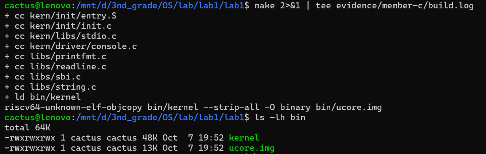
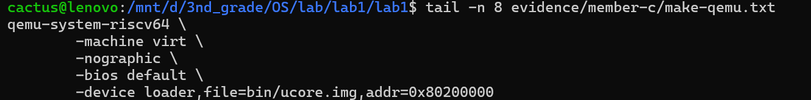
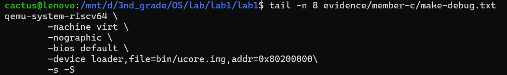
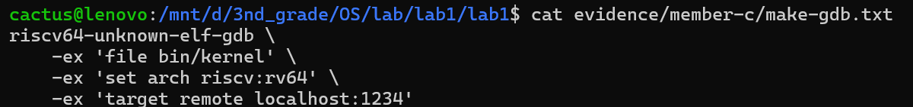
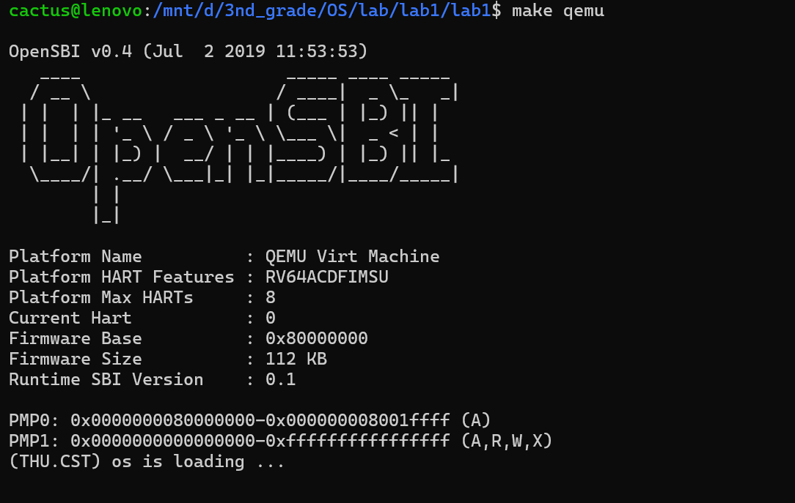
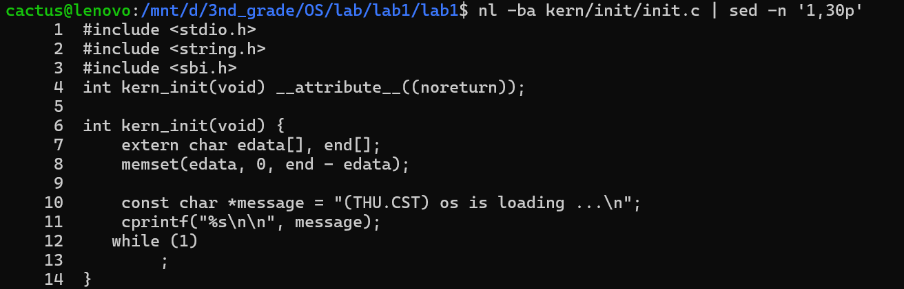
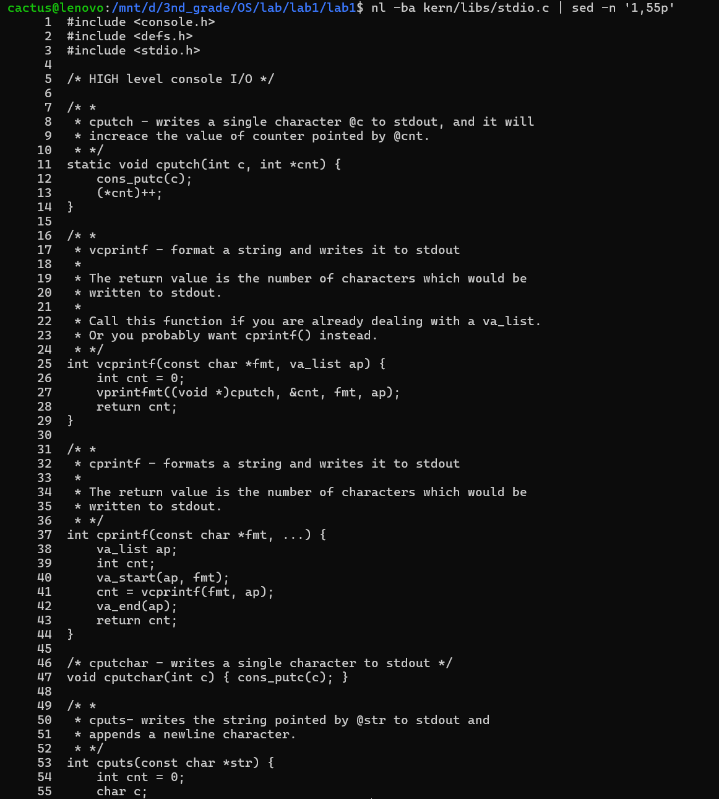
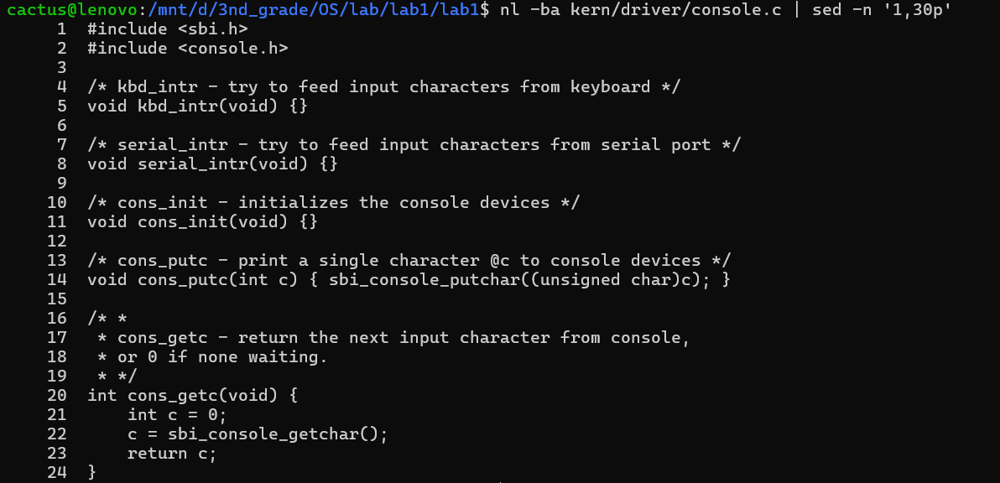
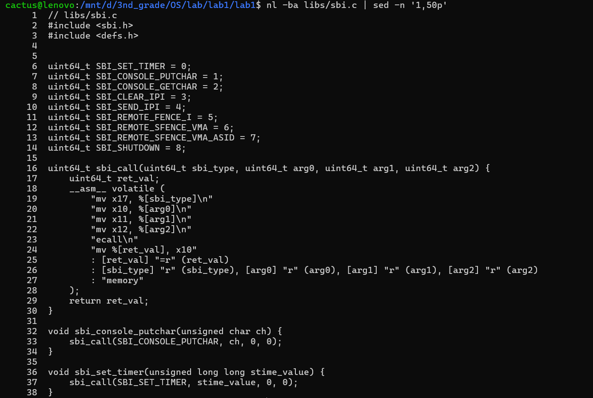
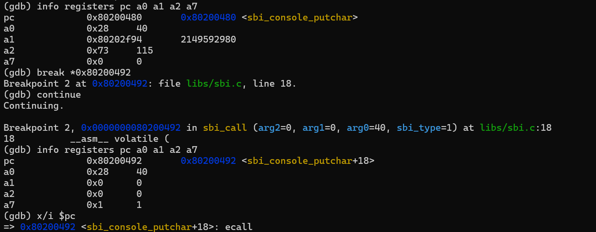

# Lab 1 实验报告：最小 RISC-V uCore 的启动、入口、构建与输出机制

## 1. 实验目的与小组分工

本次 Lab 1 围绕一个最小可执行的 RISC-V uCore 内核展开，主要完成两道练习，并结合源码、构建系统、链接结果和 GDB 调试记录理解从机器复位到内核运行的完整过程。

本组分工如下：

- **国峻赫**：练习 2 —— 使用 GDB 验证从复位引导代码、OpenSBI 到内核入口的启动流程，并记录关键寄存器、断点与运行结果；
- **尚文轩**：练习 1 —— 分析 `kern/init/entry.S`、内核栈初始化、`tail kern_init`、链接脚本和内核段布局；
- **陈铭宇**：分析 Makefile 构建流程、QEMU/GDB 命令、内核镜像加载方式以及 `cprintf → SBI → ecall` 输出调用链，并负责最终报告整合。


---

## 2. 实验环境与说明

小组三名成员分别在自己的 WSL 环境中完成验证，因此工具的次版本和 OpenSBI 版本存在差异。核心源码和内核侧关键地址保持一致。

### 2.1 小组基线环境

国峻赫与陈铭宇使用的主要工具为：

| 项目 | 版本/环境 |
| --- | --- |
| 主机 | Windows + WSL |
| 交叉编译器 | SiFive GCC-Metal 10.2.0 |
| 调试器 | SiFive GDB-Metal 10.1 |
| QEMU | 4.1.1 |
| OpenSBI | v0.4 |
| 目标架构 | RISC-V 64 |

### 2.2 尚文轩的独立复核环境

尚文轩使用 Ubuntu 22.04.5 LTS、GCC 10.2.0、QEMU 6.2.0、OpenSBI v1.3 进行了独立复核。固件版本不同导致入口前的 `sp`、`a1` 等固件侧数值不同，但以下内核侧关键地址与基线环境一致：

```text
kern_entry      = 0x80200000
kern_init       = 0x8020000a
bootstack       = 0x80201000
bootstacktop    = 0x80203000
cprintf         = 0x80200056
最终循环        = 0x8020003a
```

因此最终报告将固件侧数值按各自实测记录保留，而内核侧结论按共同构建结果统一说明。

---

# 练习 1：内核入口、栈初始化与链接布局

## 3. 练习 1 的完整回答

### 3.1 `la sp, bootstacktop` 做了什么？为什么要这样做？

`la` 是 RISC-V 的伪指令，用于把符号地址装入寄存器。入口代码：

```asm
kern_entry:
    la sp, bootstacktop
    tail kern_init
```

在本次最终链接结果中：

```text
0x80200000: auipc sp,0x3
0x80200004: mv    sp,sp
```

执行第一条后：

```text
sp = 0x80200000 + 0x3000 = 0x80203000
```

而 `bootstacktop` 的链接地址也正是：

```text
bootstacktop = 0x80203000
```

因此 `la sp, bootstacktop` 的作用是把内核自己的启动栈顶地址装入 `sp`。

这一步必须发生在进入 C 函数之前。`kern_init` 的反汇编中很快出现：

```text
addi sp,sp,-16
sd   ra,8(sp)
```

说明 C 函数立即需要合法的栈空间来建立栈帧、保存返回地址和执行后续函数调用。如果仍使用固件遗留栈，可能覆盖固件使用的内存；如果 `sp` 指向非法区域，则第一次栈访问就可能失败。

因此入口汇编首先建立内核自己的栈环境。

### 3.2 `tail kern_init` 做了什么？为什么不用普通 `call`？

`tail` 是尾调用伪指令。本次链接后变成：

```text
0x80200008: j 0x8020000a <kern_init>
```

它直接跳入 `kern_init`，不需要像普通函数调用一样保留新的返回地址。

`kern_init` 在源码中被声明为：

```c
int kern_init(void) __attribute__((noreturn));
```

并最终进入：

```c
while (1)
    ;
```

因此 `kern_init` 本来就不会返回，入口汇编在交出控制权后也没有需要继续执行的工作。使用尾跳转与这种 `noreturn` 语义一致。

---

## 4. `entry.S` 与实际反汇编

### 4.1 源码

`kern/init/entry.S`：

```asm
.section .text,"ax",%progbits
.globl kern_entry
kern_entry:
    la sp, bootstacktop
    tail kern_init

.section .data
    .align PGSHIFT
    .global bootstack
bootstack:
    .space KSTACKSIZE
    .global bootstacktop
bootstacktop:
```

### 4.2 链接前目标文件

`entry.o` 中：

```text
0000000000000000 <kern_entry>:
   0: auipc sp,0x0
   4: mv    sp,sp
   8: auipc t1,0x0
   c: jr    t1
```

此时 `bootstacktop` 和 `kern_init` 的最终地址尚未确定，所以汇编器保留重定位信息。原始输出见：

[docs/logs/entry-layout.txt](docs/logs/entry-layout.txt)

主要重定位类型包括：

```text
R_RISCV_PCREL_HI20
R_RISCV_PCREL_LO12_I
R_RISCV_CALL
R_RISCV_RELAX
```

### 4.3 链接后的实际指令

`bin/kernel` 中：

```text
0000000080200000 <kern_entry>:
    80200000: 00003117    auipc sp,0x3
    80200004: 00010113    mv    sp,sp
    80200008: a009        j     8020000a <kern_init>
```

链接器完成两件重要工作：

1. 根据 `bootstacktop = 0x80203000` 填充 `la` 所需的 PC 相对立即数；
2. 将原来的 `tail` 调用序列松弛为短跳转 `j`。

对应关系为：

| 源码 | 目标文件阶段 | 最终链接结果 |
| --- | --- | --- |
| `la sp, bootstacktop` | `auipc sp,0x0` + `addi sp,sp,0` | `auipc sp,0x3` + `mv sp,sp` |
| `tail kern_init` | `auipc t1,0x0` + `jr t1` | `j 0x8020000a` |

---

## 5. 链接脚本与内核布局

### 5.1 `tools/kernel.ld`

链接脚本关键内容：

```ld
OUTPUT_ARCH(riscv)
ENTRY(kern_entry)
BASE_ADDRESS = 0x80200000;
```

其中：

- `ENTRY(kern_entry)` 指定 ELF 入口；
- `BASE_ADDRESS = 0x80200000` 指定内核链接基址；
- 该基址同时与 QEMU loader 的装载地址一致。

段布局按脚本依次组织为：

```text
.text
→ .rodata
→ ALIGN(0x1000)
→ .data
→ .sdata
→ edata
→ .bss
→ end
```

### 5.2 实际段布局

本次 `readelf -S` 结果为：

| 段 | 起始地址 | 大小 | 说明 |
| --- | ---: | ---: | --- |
| `.text` | `0x80200000` | `0x4c8` | 代码 |
| `.rodata` | `0x802004c8` | `0x270` | 只读字符串等 |
| `.data` | `0x80201000` | `0x2000` | 主要为启动栈 |
| `.sdata` | `0x80203000` | `0x8` | `SBI_CONSOLE_PUTCHAR` |
| `.bss` | 无 | 0 | 当前构建没有未初始化全局数据 |

### 5.3 关键符号

```text
kern_entry          0x80200000
kern_init           0x8020000a
bootstack           0x80201000
bootstacktop        0x80203000
SBI_CONSOLE_PUTCHAR 0x80203000
edata               0x80203008
end                 0x80203008
```

`bootstacktop` 与 `SBI_CONSOLE_PUTCHAR` 恰好地址相同，因此 GDB 有时会把 `sp = 0x80203000` 显示为：

```text
0x80203000 <SBI_CONSOLE_PUTCHAR>
```

这只是符号显示重合。`bootstacktop` 是栈顶边界，而 `.sdata` 中的变量从同一地址开始；栈向低地址增长，因此实际栈帧不会覆盖该变量。

---

## 6. 内核启动栈

### 6.1 栈大小

源码定义：

```c
#define KSTACKPAGE  2
#define KSTACKSIZE  (KSTACKPAGE * PGSIZE)
```

其中：

```text
PGSIZE = 4096
```

所以：

```text
KSTACKSIZE = 2 × 4096 = 8192 B = 8 KiB
```

实际范围：

```text
bootstack    = 0x80201000
bootstacktop = 0x80203000
```

正好相差 `0x2000 = 8 KiB`。

### 6.2 GDB 验证

成员 B 的调试日志记录：

| 位置 | PC | SP |
| --- | --- | --- |
| 入口第一条指令前 | `0x80200000` | `0x80026eb0` |
| 执行 `auipc sp,0x3` 后 | `0x80200004` | `0x80203000` |
| 执行 `mv sp,sp` 后 | `0x80200008` | `0x80203000` |
| 进入 `kern_init` | `0x8020000a` | `0x80203000` |
| `kern_init` 建立栈帧后 | `0x8020003a` | `0x80202ff0` |

基线环境中入口前的固件栈值不同，但执行 `la sp, bootstacktop` 后都统一得到：

```text
sp = 0x80203000
```


图 1：内核入口断点命中。


图 2：执行入口栈初始化后，`sp` 与 `bootstacktop` 一致。

---

## 7. `kern_init` 与 BSS 清零

`kern_init` 开头：

```c
extern char edata[], end[];
memset(edata, 0, end - edata);
```

当前构建：

```text
edata = 0x80203008
end   = 0x80203008
```

所以：

```text
end - edata = 0
```

成员 B 的 GDB 记录也实际观察到：

```text
memset(s=0x80203008, c=0, n=0)
```

因此本次 Lab 1 中没有实际需要清零的 `.bss` 数据，清零长度为 0。该逻辑仍然保留，为后续实验加入未初始化全局数据做准备。

---

## 8. 练习 1 结论

练习 1 的结论如下：

1. `la sp, bootstacktop` 把内核启动栈顶地址装入 `sp`，建立进入 C 语言前所需的运行时栈环境；
2. `bootstack` 到 `bootstacktop` 共 8 KiB，位于 `.data` 段，栈向低地址增长；
3. `tail kern_init` 不建立普通返回链，直接把控制权交给不会返回的 `kern_init`；
4. 伪指令在目标文件阶段留下重定位信息，链接后得到最终地址和更短的跳转形式；
5. `tools/kernel.ld` 统一控制入口地址、内核链接基址和各段布局；
6. GDB 实际验证了 `sp` 从固件栈切换到 `0x80203000`，并进入 `kern_init`。

---

# 练习 2：使用 GDB 验证启动流程

## 9. 调试方法

使用两个 WSL 终端。

终端 1：

```bash
make debug
```

终端 2：

```bash
make gdb
```

实际 `make gdb` 命令为：

```bash
riscv64-unknown-elf-gdb \
    -ex 'file bin/kernel' \
    -ex 'set arch riscv:rv64' \
    -ex 'target remote localhost:1234'
```

其中：

- `file bin/kernel`：加载内核 ELF 和符号；
- `set arch riscv:rv64`：指定 RISC-V 64 位目标；
- `target remote localhost:1234`：连接 QEMU GDB Server。

原始调试日志：

[docs/logs/startup-debug.log](docs/logs/startup-debug.log)

---

## 10. 从复位地址开始执行

GDB 连接后，初始 PC 为：

```text
0x1000
```

最初五条指令：

```text
0x1000: auipc t0,0x0
0x1004: addi  a1,t0,32
0x1008: csrr  a0,mhartid
0x100c: ld    t0,24(t0)
0x1010: jr    t0
```

同时：

```text
0x1018: 0x0000000080000000
```


图 3：复位地址处最初五条指令与固件入口地址。

逐条执行后的状态：

| 已执行指令 | 结果 |
| --- | --- |
| `auipc t0,0` | `t0 = 0x1000` |
| `addi a1,t0,32` | `a1 = 0x1020` |
| `csrr a0,mhartid` | `a0 = 0` |
| `ld t0,24(t0)` | `t0 = 0x80000000` |
| `jr t0` | PC 跳到 `0x80000000` |

因此这些指令主要完成：取得地址基准、准备启动参数、读取 Hart ID、取得 OpenSBI 入口地址并跳转。

---

## 11. 进入 OpenSBI

执行 `jr t0` 后：

```text
pc = 0x80000000
```


图 4：进入 OpenSBI 后的寄存器与入口指令。

本实验只观察了 OpenSBI 入口附近的若干指令，没有逐条跟踪整个固件。后续通过内核入口断点验证控制权最终被移交给 uCore。

---

## 12. 到达内核入口

设置：

```gdb
break *0x80200000
continue
```

GDB 命中：

```text
Breakpoint 1, kern_entry () at kern/init/entry.S:7
```

此时：

```text
pc = 0x80200000
```

说明 CPU 已经从复位引导代码进入 OpenSBI，并最终开始执行内核入口。

需要区分：

- **镜像已经放到 `0x80200000`**；
- **CPU 的 PC 已经到达 `0x80200000`**。

前者由 QEMU loader 参数说明，后者由 GDB 断点证明。二者不是同一时刻的同一事件。

---

## 13. 进入 `kern_init`、执行输出并进入循环

入口反汇编：

```text
0x80200000: auipc sp,0x3
0x80200004: mv    sp,sp
0x80200008: j     0x8020000a <kern_init>
```

继续单步后：

```text
pc = 0x8020000a <kern_init>
sp = 0x80203000
```

在 `cprintf` 设置断点后观察：

```text
a0 = 0x802004e8 → "%s\n\n"
a1 = 0x802004c8 → "(THU.CST) os is loading ...\n"
```


图 5：`cprintf` 的格式串和消息字符串。

执行完成后，QEMU 输出：

```text
(THU.CST) os is loading ...
```


图 6：内核启动信息输出与 `cprintf` 返回。

最终：

```text
pc = 0x8020003a
0x8020003a: j 0x8020003a
```

说明程序进入源码中的：

```c
while (1)
    ;
```

---

## 14. 练习 2 的明确回答

### 14.1 最初执行的几条指令在哪里？

在本次 QEMU `virt` 环境中，CPU 从：

```text
0x1000
```

开始执行复位引导代码。

最初五条指令位于：

```text
0x1000
0x1004
0x1008
0x100c
0x1010
```

### 14.2 它们完成什么功能？

它们依次：

1. 取得引导代码地址基准；
2. 准备下一阶段启动参数；
3. 读取 `mhartid`；
4. 从固定位置取得固件入口 `0x80000000`；
5. 跳转进入 OpenSBI。

随后 OpenSBI 继续执行，最终控制权被移交给：

```text
0x80200000 <kern_entry>
```

GDB 进一步验证内核建立启动栈、进入 `kern_init`、完成输出并停留在无限循环。

---

# 构建、装载与 SBI 输出机制

## 15. Makefile 构建流程

### 15.1 工具链

Makefile 定义：

```make
GCCPREFIX := riscv64-unknown-elf-
CC      := $(GCCPREFIX)gcc
LD      := $(GCCPREFIX)ld
OBJCOPY := $(GCCPREFIX)objcopy
OBJDUMP := $(GCCPREFIX)objdump
GDB     := $(GCCPREFIX)gdb
```

因此整个项目采用 RISC-V 裸机交叉工具链构建。

### 15.2 自动收集源文件

Makefile 引入：

```make
include tools/function.mk
```

其中 `listf`、`toobj`、`cc_template`、packet 等规则自动完成：

```text
源文件枚举
→ .o 文件路径生成
→ 依赖文件 .d 生成
→ kernel / libs 对象集合组织
```

### 15.3 实际构建结果

实际 `make` 输出：

```text
+ cc kern/init/entry.S
+ cc kern/init/init.c
+ cc kern/libs/stdio.c
+ cc kern/driver/console.c
+ cc libs/printfmt.c
+ cc libs/readline.c
+ cc libs/sbi.c
+ cc libs/string.c
+ ld bin/kernel
riscv64-unknown-elf-objcopy bin/kernel --strip-all -O binary bin/ucore.img
```



图 7：源码编译、链接和 `ucore.img` 生成成功。

### 15.4 构建链

```text
.c / .S
   ↓
riscv64-unknown-elf-gcc
   ↓
obj/.../*.o
   ↓
riscv64-unknown-elf-ld + tools/kernel.ld
   ↓
bin/kernel（ELF）
   ↓
objcopy --strip-all -O binary
   ↓
bin/ucore.img（裸二进制镜像）
```

其中：

- `bin/kernel` 保留 ELF、符号和调试信息，供 GDB、objdump 等使用；
- `bin/ucore.img` 是裸二进制镜像，供 QEMU loader 放入目标物理地址。

原始命令记录见：

[docs/logs/build-commands.txt](docs/logs/build-commands.txt)

---

## 16. `make qemu`、`make debug` 与 `make gdb`

### 16.1 `make qemu`

实际命令：

```bash
qemu-system-riscv64 \
    -machine virt \
    -nographic \
    -bios default \
    -device loader,file=bin/ucore.img,addr=0x80200000
```



图 8：`make qemu` 的实际命令。

关键参数：

- `-machine virt`：使用 RISC-V `virt` 平台；
- `-nographic`：不创建图形窗口，终端作为控制台；
- `-bios default`：使用默认 OpenSBI；
- `loader ... addr=0x80200000`：将 `ucore.img` 放入目标物理地址。

### 16.2 `make debug`

```bash
qemu-system-riscv64 \
    -machine virt \
    -nographic \
    -bios default \
    -device loader,file=bin/ucore.img,addr=0x80200000 \
    -s -S
```



图 9：`make debug` 的实际命令。

其中：

- `-s`：开放默认 GDB 远程调试端口 1234；
- `-S`：启动后先暂停 CPU。

### 16.3 `make gdb`

```bash
riscv64-unknown-elf-gdb \
    -ex 'file bin/kernel' \
    -ex 'set arch riscv:rv64' \
    -ex 'target remote localhost:1234'
```



图 10：`make gdb` 的实际命令。

---

## 17. QEMU、OpenSBI 与内核镜像的关系

本次运行关系可以概括为：

```text
QEMU 创建 RISC-V virt 平台
      │
      ├── 准备默认 OpenSBI
      └── 将 ucore.img 放入 0x80200000
                │
                ▼
CPU 从复位引导代码执行
      │
      ▼
OpenSBI（0x80000000）
      │
      ▼
移交控制权
      │
      ▼
kern_entry（0x80200000）
```



图 11：OpenSBI 启动后内核正常打印启动信息。

因此：

- QEMU loader 负责把 `ucore.img` 放到目标内存；
- OpenSBI 负责启动阶段的机器态固件工作；
- GDB 在 `kern_entry` 命中只能证明 CPU 已开始执行内核入口，不能单独证明此时才发生镜像装载。

---

## 18. 从 `kern_init` 到终端的输出调用链

### 18.1 `kern_init`

```c
const char *message = "(THU.CST) os is loading ...\n";
cprintf("%s\n\n", message);
```



图 12：`kern_init` 中的输出入口。

### 18.2 `cprintf → vcprintf → vprintfmt`

`cprintf`：

```c
cnt = vcprintf(fmt, ap);
```

`vcprintf`：

```c
vprintfmt((void *)cputch, &cnt, fmt, ap);
```

因此 `vprintfmt` 负责解析 `%s` 等格式控制符，每获得一个最终字符，就调用 `cputch`。



图 13：`cputch`、`vcprintf` 与 `cprintf`。

### 18.3 `cputch → cons_putc`

```c
static void cputch(int c, int *cnt) {
    cons_putc(c);
    (*cnt)++;
}
```

`cons_putc`：

```c
void cons_putc(int c) {
    sbi_console_putchar((unsigned char)c);
}
```



图 14：console 层将字符继续交给 SBI。

### 18.4 `sbi_console_putchar → sbi_call → ecall`

`libs/sbi.c`：

```c
uint64_t SBI_CONSOLE_PUTCHAR = 1;
```

```c
void sbi_console_putchar(unsigned char ch) {
    sbi_call(SBI_CONSOLE_PUTCHAR, ch, 0, 0);
}
```

核心内联汇编：

```asm
mv x17, sbi_type
mv x10, arg0
mv x11, arg1
mv x12, arg2
ecall
```

对应寄存器：

```text
x10 = a0
x11 = a1
x12 = a2
x17 = a7
```

所以字符输出前：

```text
a7 = 1
a0 = 字符值
a1 = 0
a2 = 0
```



图 15：SBI 服务号、参数寄存器与 `ecall`。

完整调用链：

```text
kern_init
  ↓
cprintf
  ↓
vcprintf
  ↓
vprintfmt
  ↓
cputch
  ↓
cons_putc
  ↓
sbi_console_putchar
  ↓
sbi_call
  ↓
ecall
  ↓
OpenSBI
  ↓
QEMU 控制台
  ↓
宿主机终端
```

---

## 19. GDB 验证 SBI 参数

由于 `-O2` 优化，`sbi_call` 没有作为独立可断点函数保留，而被内联进 `sbi_console_putchar`。

反汇编得到：

```text
0x8020048a: mv a7,a4
0x8020048c: mv a0,a0
0x8020048e: mv a1,a5
0x80200490: mv a2,a5
0x80200492: ecall
```

因此设置：

```gdb
break *0x80200492
```

命中后实际观察：

```text
pc = 0x80200492
a0 = 0x28 = 40
a1 = 0
a2 = 0
a7 = 1
=> ecall
```



图 16：`ecall` 执行前的 SBI 参数寄存器。

此时 `0x28` 对应字符 `'('`，正好是启动字符串的第一个字符；`a7 = 1` 与 `SBI_CONSOLE_PUTCHAR = 1` 一致。

---

## 20. `cprintf` 返回值 30

`message`：

```text
(THU.CST) os is loading ...\n
```

自身共有 28 个字符，而格式：

```text
%s\n\n
```

又额外输出两个换行，因此总输出字符数：

```text
28 + 2 = 30
```

`cputch` 对每个字符执行：

```c
(*cnt)++;
```

所以最终 `cprintf` 返回 30，与 GDB 实测结果一致。

---

# 实验中遇到的问题与处理

## 21. QEMU 环境变量冲突

曾出现：

```text
make: execvp: .../qemu: Permission denied
```

原因是把环境变量 `QEMU` 设置成了 QEMU 安装目录，而 Makefile 中 `QEMU` 本来表示可执行程序名。

处理方式是：

- 不再用 `QEMU` 表示安装目录；
- 改用如 `QEMU_HOME` / `QEMU_OSLAB`；
- 把 `$QEMU_HOME/bin` 加入 `PATH`；
- 在已有终端中执行 `unset QEMU`。

处理后 `make qemu`、`make debug` 均恢复正常。

## 22. `sbi_call` 无法直接断点

执行：

```gdb
break sbi_call
```

GDB 提示找不到独立函数符号。结合反汇编可以确认，在 `-O2` 优化下，`sbi_call` 已被内联到 `sbi_console_putchar`。

因此改为：

1. 对 `sbi_console_putchar` 反汇编；
2. 找到实际 `ecall` 地址；
3. 在 `0x80200492` 设置地址断点；
4. 验证参数寄存器。

## 23. 不同 OpenSBI 版本导致固件侧数值不同

不同成员使用 OpenSBI v0.4 和 v1.3，因此入口前固件栈和部分启动参数不同。例如：

```text
sp = 0x8001bd80
```

和：

```text
sp = 0x80026eb0
```

都可能出现。

这些属于固件内部布局差异。执行内核第一条指令后，两套环境都把：

```text
sp
```

设置为：

```text
0x80203000
```

说明核心内核结论一致。

---

# 实验与操作系统理论的联系

## 24. 启动过程与执行权移交

实验把抽象的“计算机启动”具体化为：

```text
复位引导
→ 固件
→ 内核入口
→ C 初始化
```

每一步都能通过 PC、断点和寄存器观察到执行权的转移。

## 25. 栈与运行时环境

C 语言函数不是天然可运行的。内核入口必须先提供合法栈，然后才能安全地进入 `kern_init`。这说明编译器生成的 C 代码依赖最基本的 ABI 和运行时约定。

## 26. 构建、装载和执行是不同阶段

本实验明确区分：

```text
源码 → ELF
ELF → 裸镜像
裸镜像 → 目标内存
CPU → 开始执行内核
```

这四件事在概念和时序上都不同。

## 27. 特权级与 SBI

内核不能把更高特权级的机器态功能当成普通 C 函数直接执行，而通过：

```text
参数寄存器 + ecall
```

请求 OpenSBI 服务。

这种结构与后续“用户态通过系统调用进入内核态”在设计思想上相似：都通过受控接口跨越特权边界。

## 28. 模块化输出设计

输出链：

```text
格式化层
→ console 抽象层
→ SBI 接口层
→ 固件
→ 模拟设备
```

不同模块之间通过清晰接口连接，使高层输出代码无需了解底层控制台实现细节。


---

# 实验总结

## 30. 总体结论

本次 Lab 1 完成了从代码构建到最小内核运行的完整闭环：

```text
源码
  ↓
交叉编译与链接
  ↓
bin/kernel
  ↓
bin/ucore.img
  ↓
QEMU 装载
  ↓
复位引导代码
  ↓
OpenSBI
  ↓
kern_entry
  ↓
设置内核栈
  ↓
kern_init
  ↓
cprintf
  ↓
SBI ecall
  ↓
终端输出
  ↓
无限循环
```

通过练习 1，我们确认了：

- `la sp, bootstacktop` 的实际机器指令和作用；
- `tail kern_init` 的尾跳转语义；
- 内核启动栈的大小、位置、方向；
- 链接脚本与各段、关键符号的布局关系；
- `kern_init` 的入口和 BSS 初始化行为。

通过练习 2，我们确认了：

- QEMU 从 `0x1000` 的复位引导代码开始执行；
- 最初五条指令准备启动参数并跳入 `0x80000000` 的 OpenSBI；
- OpenSBI 最终将执行权交给 `0x80200000` 的 `kern_entry`；
- 内核随后建立自己的栈、进入 C 代码、打印启动信息并进入无限循环。

通过构建和 SBI 分析，我们进一步确认：

- Makefile 自动组织源文件、目标文件、ELF 和裸镜像；
- `make qemu / debug / gdb` 分别对应运行、调试服务和 GDB 连接；
- QEMU loader 将 `ucore.img` 放到 `0x80200000`，而“CPU 开始执行内核”需要等 OpenSBI 移交控制权；
- 启动文字沿 `cprintf → vcprintf → vprintfmt → cputch → cons_putc → sbi_console_putchar → sbi_call → ecall` 到达 OpenSBI；
- GDB 实际验证了字符输出 `ecall` 前 `a7=1、a0=40、a1=0、a2=0`。

本实验最大的收获是把“操作系统启动”从抽象流程落实到了具体文件、地址、指令、寄存器、链接布局和调用链中，为后续中断、内存管理、进程与文件系统实验建立了最基本的运行和调试基础。

---

## 31. 原始材料索引

为保证实验结果可复查，仓库保留以下原始材料：

### 分析文档

- [docs/entry-analysis.md](docs/entry-analysis.md)：练习 1、入口汇编、栈初始化和链接布局；
- [docs/startup-debug.md](docs/startup-debug.md)：练习 2、复位到内核入口的 GDB 启动调试；
- [docs/build-sbi.md](docs/build-sbi.md)：构建、装载和 SBI 输出机制。

### 日志

- [docs/logs/entry-layout.txt](docs/logs/entry-layout.txt)：ELF、段布局、符号和反汇编输出；
- [docs/logs/entry-gdb.log](docs/logs/entry-gdb.log)：练习 1 相关 GDB 验证；
- [docs/logs/startup-debug.log](docs/logs/startup-debug.log)：练习 2 启动调试记录；
- [docs/logs/build-commands.txt](docs/logs/build-commands.txt)：构建、QEMU、debug 和 GDB 实际命令。

### 关键截图

- `docs/images/lab1_1.png` ～ `lab1_5.png`、`lab1_8.png`：启动与 GDB 调试证据；
- `docs/images/lab1_build_success.png`：构建成功；
- `docs/images/lab1_qemu_boot.png`：QEMU/OpenSBI/内核正常运行；
- `docs/images/lab1_make_qemu_command.png`：QEMU 命令；
- `docs/images/lab1_make_debug_command.png`：debug 命令；
- `docs/images/lab1_make_gdb_command.png`：GDB 命令；
- `docs/images/lab1_kern_init_output.png`：`kern_init` 输出源码；
- `docs/images/lab1_stdio_printf_chain.png`：stdio 输出调用链；
- `docs/images/lab1_console_cons_putc.png`：console 调用；
- `docs/images/lab1_sbi_source.png`：SBI 源码；
- `docs/images/lab1_sbi_ecall_registers.png`：`ecall` 前寄存器实测。
